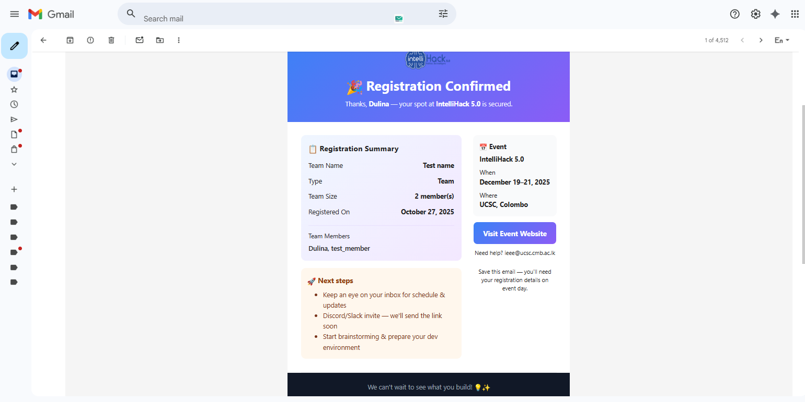

# IntelliHack 5.0 - Hackathon Website

## 🎯 Project Overview

This is a creative web concept developed for the **IEEE Computer Society UCSC Web Team Recruitment Task**. The project showcases a fully functional website for IntelliHack 5.0, an upcoming AI hackathon event hosted by IEEE Computer Society — UCSC Student Branch Chapter.

**Live Demo**: [https://ucsc-ieee-cs-web-task-2025.vercel.app/](https://ucsc-ieee-cs-web-task-2025.vercel.app/)

### ✨ Key Highlight

**Email Notification System**: This website features a fully integrated **EmailJS** email notification system. When users register for the hackathon (either as an individual or as part of a team), they automatically receive a professional confirmation email with:

-   Registration details (team name, member names, registration type)
-   Event information (date, time, venue)
-   Next steps and important reminders
-   Contact information and social links

**Production Ready**: All EmailJS credentials have been configured as environment variables in Vercel for secure production deployment.

## ✨ Features

This website includes the following sections and features:

### 🎨 Sections Implemented

-   **Hero Section** - Eye-catching landing with animated particle background
-   **About Section** - Information about IntelliHack 5.0 and its theme
-   **Timeline Section** - Event schedule with interactive timeline cards
-   **Registration Form** - Dynamic form with individual and team registration options
-   **FAQ Section** - Comprehensive accordion-style frequently asked questions
-   **Footer** - Contact information and social media links

### 🚀 Key Functionalities

-   **Dynamic Registration System**

    -   Toggle between Individual and Team registration
    -   Team registration with dynamic form fields (2-4 members)
    -   Team Member 1 designated as Team Leader
    -   Form validation for all fields
    -   Email validation
    -   **Email Confirmation** - Automated confirmation emails via EmailJS
    -   Local storage for registration data

-   **Email Integration**

    -   **Automated email notifications** via EmailJS integration
    -   Professional HTML email templates with IntelliHack 5.0 branding
    -   Confirmation emails sent automatically upon registration
    -   Individual registrants receive email at their provided address
    -   Team leaders (Team Member 1) receive email with full team details
    -   Registration details and event information included in email
    -   Emails include next steps, important reminders, and contact info
    -   **Production configured**: EmailJS credentials securely added to Vercel environment variables

-   **Theme System**

    -   Dark mode as default theme
    -   Light and Dark mode toggle
    -   Theme-persistent throughout the site
    -   Adaptive logo display based on theme

-   **Interactive Elements**

    -   Animated particle background
    -   Smooth scroll navigation
    -   Collapsible social sidebar
    -   Hover effects and transitions
    -   FAQ accordion with smooth animations

-   **Responsive Design**

    -   Fully responsive across all devices
    -   Adaptive layouts for tablet and desktop views

## 🛠️ Technologies Used

This project is built with modern web technologies:

-   **Framework**: React 18 with TypeScript
-   **Build Tool**: Vite
-   **Styling**: Tailwind CSS
-   **UI Components**: shadcn/ui
-   **Icons**: Lucide React
-   **Theme Management**: next-themes
-   **Email Service**: EmailJS (with automated confirmation emails)
-   **Animations**: CSS animations and Tailwind transitions
-   **Deployment**: Vercel (with environment variables configured)

## 📁 Project Structure

```
intellihack-spark/
├── src/
│   ├── components/
│   │   ├── About.tsx
│   │   ├── FAQ.tsx
│   │   ├── Footer.tsx
│   │   ├── Header.tsx
│   │   ├── Hero.tsx
│   │   ├── ParticleBackground.tsx
│   │   ├── RegistrationForm.tsx
│   │   ├── SocialSidebar.tsx
│   │   ├── SponsorGrid.tsx
│   │   ├── ThemeProvider.tsx
│   │   ├── ThemeToggle.tsx
│   │   ├── Timeline.tsx
│   │   └── ui/ (shadcn components)
│   ├── pages/
│   │   ├── Index.tsx
│   │   └── NotFound.tsx
│   ├── assets/ (images and logos)
│   ├── hooks/
│   ├── lib/
│   └── main.tsx
├── public/
├── index.html
└── package.json
```

## 🚀 Getting Started

### Prerequisites

-   Node.js (v18 or higher)
-   npm package manager

### Installation

1. Clone the repository:

```sh
git clone https://github.com/dulina2004/ucsc-ieee-cs-web-task-2025.git
cd ucsc-ieee-cs-web-task-2025
```

2. Install dependencies:

```sh
npm install
```

3. Set up EmailJS (Optional - for email notifications):

```sh
# Copy the example environment file
cp .env.example .env

# Edit .env and add your EmailJS credentials:
# VITE_EMAILJS_SERVICE_ID=your_service_id
# VITE_EMAILJS_TEMPLATE_ID=your_template_id
# VITE_EMAILJS_PUBLIC_KEY=your_public_key
```

See [EMAILJS_SETUP.md](./EMAILJS_SETUP.md) for detailed EmailJS configuration instructions.

**Note**: For the live production site, EmailJS environment variables have already been configured in Vercel, so email notifications work automatically on the deployed site.

4. Start the development server:

```sh
npm run dev
```

5. Open your browser and navigate to:

```
http://localhost:5173
```

### Build for Production

```sh
npm run build
```

### Preview Production Build

```sh
npm run preview
```

## 🎨 Design Highlights

### Color Scheme

-   Primary gradient: Blue to Purple (representing AI and innovation)
-   Light and Dark theme support
-   Consistent color palette throughout

### Typography

-   Font Family: Inter (Google Fonts)
-   Clear hierarchy with appropriate font sizes
-   Readable and accessible text

### UI/UX Features

-   Smooth scrolling navigation
-   Intuitive form design with clear validation messages
-   Interactive elements with hover states
-   Loading states and transitions
-   Accessible design with proper ARIA labels

## 🎯 Evaluation Criteria Met

✅ **Creativity & Uniqueness**

-   Original design concept with custom particle background
-   Unique registration system with dynamic team member forms
-   Creative use of gradient effects and animations

✅ **Visual Appeal**

-   Modern, clean design with consistent styling
-   Smooth animations and transitions
-   Professional color scheme and typography
-   Theme-adaptive components

✅ **Concept Execution**

-   Fully functional website with all major sections
-   Complete registration workflow with email notifications
-   Interactive FAQ and timeline
-   Responsive across all devices
-   Production-ready deployment

## 🌟 Unique Features

1. **Particle Background** - Custom animated particle system for visual appeal
2. **Dynamic Registration** - Smart form that adapts based on registration type
3. **Email Notifications** - Automated confirmation emails via EmailJS integration
    - Professional HTML email templates with event branding
    - Automatic email delivery upon successful registration
    - Team leaders receive consolidated team information
    - Environment variables configured in Vercel for production use
4. **Social Sidebar** - Collapsible social media sidebar with smooth animations
5. **Theme-Adaptive Logos** - Different logos for light and dark themes
6. **Form Validation** - Comprehensive validation with user-friendly error messages
7. **Local Storage** - Persistent registration data storage

## � Deployment

This project is deployed on **Vercel** with full production configuration.

### Environment Variables

The following environment variables have been configured in Vercel for email functionality:

-   `VITE_EMAILJS_SERVICE_ID` - EmailJS service identifier
-   `VITE_EMAILJS_TEMPLATE_ID` - Email template identifier
-   `VITE_EMAILJS_PUBLIC_KEY` - EmailJS public API key

These variables enable the automated email notification system to work seamlessly in production. When users register for the hackathon through the live site, they receive immediate confirmation emails.

### Deploying Your Own Instance

If you want to deploy your own instance:

1. Fork this repository
2. Create an account on [Vercel](https://vercel.com)
3. Import your forked repository
4. Add the three EmailJS environment variables in Vercel project settings
5. Deploy!

For detailed EmailJS setup instructions, see [EMAILJS_SETUP.md](./EMAILJS_SETUP.md).

## �👨‍💻 Developer

**Dulina Gunasinghe**

-   GitHub: [@dulina2004](https://github.com/dulina2004)

## 📄 License

This project was created as part of the IEEE Computer Society UCSC Web Team Recruitment Task.

---
